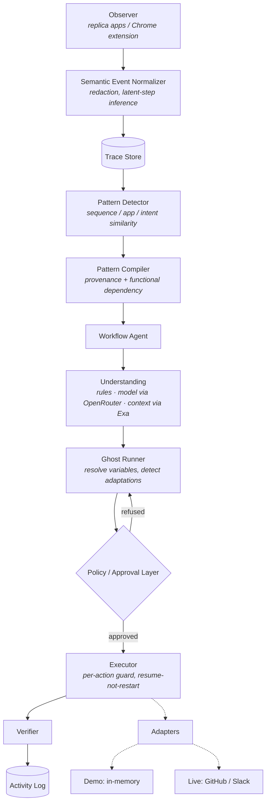
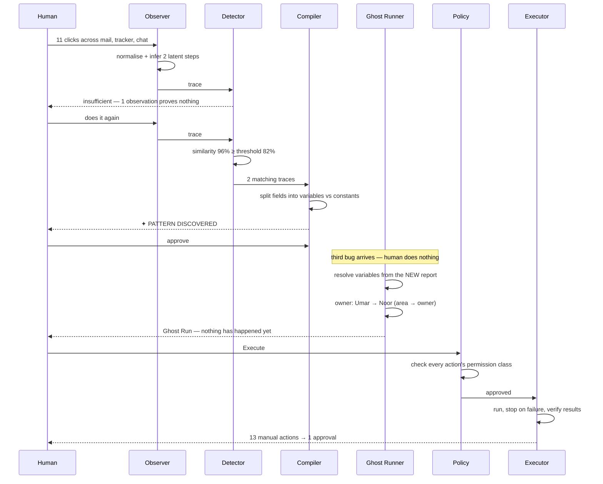

# REPEAT

**Show it once. Never do it again.**

REPEAT is an AI layer that learns repetitive workflows by watching how a person
already works. It lives inside the tools where the work happens, not in a chat
window beside them.

Built by **Team Kanban**.

---

## Overview

Automation normally starts by asking a human to document their workflow: pick a
trigger, add conditions, wire up actions, test it. The work of describing the
process is often larger than the process.

REPEAT asks a different question — *what if the workflow documented itself?*

```
Traditional automation                 REPEAT
──────────────────────                 ──────
human defines trigger                  human works normally
human defines conditions                       ↓
human defines actions                  REPEAT observes semantic actions
human tests workflow                           ↓
        ↓                              REPEAT recognises a repetition
     workflow                                  ↓
                                       REPEAT generalises it
                                               ↓
                                       REPEAT generates an agent
                                               ↓
                                       REPEAT shows a Ghost Run
                                               ↓
                                       human approves
                                               ↓
                                       REPEAT does it next time
```

The core principle: **the user's behaviour is the prompt.**

---

## Problem

A support engineer receives a bug report by email. They read it, work out what
is actually broken, write an engineering ticket, label it, prioritise it, decide
who owns it, file it, and tell the team. Then they do it again. And again.

Measured against this prototype's own effort model, one pass is **13 semantic
actions across 3 applications, roughly 4m 43s** of human attention. Nobody
writes a Zapier rule for it, because describing it costs more than doing it once
— and so it never gets automated at all.

---

## How REPEAT is different

It is easy to build something that looks like this and is actually a macro.
Three things separate REPEAT from one:

### 1. It records meaning, not mechanics

An observation is never a coordinate or a keystroke. It is a semantic verb plus
a normalised payload:

```
   macro recorder                REPEAT
   ──────────────                ──────
   click x=531 y=322             mail.read_message
   click x=821 y=415             issue.extract_details
   type "Noor"                   tracker.assign_owner
```

The event model in [`types/index.ts`](types/index.ts) has no field capable of
holding a coordinate. The self-test asserts this
([`scripts/verify-engine.ts`](scripts/verify-engine.ts): *"trace 1 records no
coordinates"*).

### 2. It names the steps you never clicked

A human never clicks "understand the issue". But when unstructured email prose
becomes a structured title, labels and a priority, an understanding step
demonstrably happened in between. REPEAT infers those latent steps, marks them
`inferred`, gives them lower confidence, and shows them as inferred in the
timeline. That is why 11 observed clicks compile into a 13-action trace and a
5-step workflow.

### 3. It refuses to memorise what it can derive — *this is the important one*

Both training bugs in the demo are backend bugs assigned to Umar. A naive
compiler diffs the two observations, sees that `owner` never changed, and bakes
in "always assign Umar". **That is exactly how you get a macro.**

So in REPEAT, constants have to earn it. A field is only a constant when **both**
hold:

1. its provenance is `authored` — the human chose the value themselves and
   nothing in the trigger implies it, and
2. no known rule already derives it from another field.

Everything computed from the trigger — extracted, classified, routed, generated —
stays bound even if every sample happened to agree. Two identical samples are not
evidence of a constant; they are one coincidence.

The result, straight out of the compiler:

| Field | Observed values | Decision |
|---|---|---|
| Customer | Alex Chen, Priya Raman | variable (extracted) |
| Issue title | *differs* | variable (extracted) |
| Engineering area | backend, **backend** | **variable** — computed from the report |
| Priority | high, **high** | **variable** — computed from the report |
| Owner | Umar, **Umar** | **variable** — satisfies `area → owner` |
| Channel | product-updates, product-updates | **constant** — you chose it |

REPEAT says this in the UI, in words, on the Pattern Discovered card:

> **Owner** was `Umar` in every observation, but it is *consistent with the rule
> `area → owner`, so it is bound to Engineering area rather than memorized.*

That single sentence is the technical argument. See
[`lib/patterns/compiler.ts`](lib/patterns/compiler.ts).

---

## Core interaction

```
run #1   You triage a bug report by hand.        REPEAT: ● learning
run #2   You do it again.                        REPEAT: confidence climbing
         ────────────────────────────────────────────────────────────────
         ✦ PATTERN DISCOVERED — 96%, 13 manual actions → 1 approval
         You approve. The five observed steps collapse into one agent.
         ────────────────────────────────────────────────────────────────
run #3   A third bug arrives. You do nothing.
         REPEAT detects the trigger, opens a Ghost Run, and waits.
```

The third bug is deliberately a **frontend** bug. REPEAT has only ever seen
backend bugs go to Umar, and the Ghost Run says:

```
ADAPTED   Owner    Umar  →  Noor     rule: frontend → Noor
ADAPTED   Area     backend → frontend   rule: classified from the report text
```

Nothing about that is scripted. Delete the routing rule and it stops working;
change the email text and it routes somewhere else.

---

## Architecture



Each stage is one module, and the boundaries are real:

| Stage | Module |
|---|---|
| Event model | [`types/index.ts`](types/index.ts) |
| Taxonomy + effort model | [`lib/events/taxonomy.ts`](lib/events/taxonomy.ts) |
| Normalizer + redaction | [`lib/events/normalizer.ts`](lib/events/normalizer.ts) |
| Similarity scoring | [`lib/patterns/similarity.ts`](lib/patterns/similarity.ts) |
| Detector | [`lib/patterns/detector.ts`](lib/patterns/detector.ts) |
| Compiler / generalization | [`lib/patterns/compiler.ts`](lib/patterns/compiler.ts) |
| Understanding (rules + model contract) | [`lib/agents/understanding.ts`](lib/agents/understanding.ts) |
| Live understanding (model ‖ research, in parallel) | [`lib/agents/understanding-live.ts`](lib/agents/understanding-live.ts) |
| OpenRouter client | [`lib/llm/openrouter.ts`](lib/llm/openrouter.ts) |
| Exa research client | [`lib/research/exa.ts`](lib/research/exa.ts) |
| Ghost Runner | [`lib/agents/ghost-runner.ts`](lib/agents/ghost-runner.ts) |
| Policy | [`lib/policy/policy.ts`](lib/policy/policy.ts) |
| Executor + Verifier | [`lib/agents/executor.ts`](lib/agents/executor.ts) |
| Adapters (in-memory, ClickUp, Ambiguous, GitHub, Slack, remote) | [`lib/adapters/`](lib/adapters) |
| Planner as an AG-UI agent (CopilotKit runtime) | [`app/api/copilotkit/[[...slug]]/route.ts`](app/api/copilotkit/%5B%5B...slug%5D%5D/route.ts), [`components/copilot/`](components/copilot) |
| Live engine state | [`lib/store/repeat-store.ts`](lib/store/repeat-store.ts) |

---

## Behavior-to-Agent pipeline



---

## Pattern detection

No model is trained. Three deterministic, inspectable signals:

| Signal | Method | Weight |
|---|---|---|
| Action sequence | normalised Levenshtein over the ordered verbs | 0.55 |
| Applications | Jaccard over the app set | 0.20 |
| Semantic intent | bag-of-words cosine over intent strings | 0.25 |

A pattern is offered when `similarity ≥ 0.82` and `observations ≥ 2`.

Edit distance is what makes it tolerant of real humans: in the self-test the
second pass includes an extra glance back at the email, and REPEAT still matches
it. Every number above is shown to the user in the evidence panel.

**Reported confidence is discounted for sample size.** Two identical passes are
100% *similar*, but two samples are not certainty. Confidence starts at 96% for
two observations and halves the remaining doubt with each confirming one. The
raw similarity numbers are still shown in full — the discount only governs the
headline figure, so a suspiciously perfect 100% never appears.

---

## Ghost Run safety model

A Ghost Run is a fully resolved plan that has touched nothing.

Actions are classified by consequence, and the **policy layer, not the model**,
decides what needs a human:

| Class | Allowed | Approval | Example |
|---|---|---|---|
| `read` | yes | no | read the email |
| `analyze` | yes | no | classify the issue |
| `draft` | yes | no | prepare the ticket text |
| `create_external` | yes | **yes** | create the issue, assign the owner |
| `send_message` | yes | **yes** | post to the team channel |
| `delete` | yes | **yes** | always |
| `payment` | **no** | — | blocked in this prototype |

Enforcement, not intention:

- `assertExecutable()` runs **before every single action**, not once per run, so
  no code path can slip past it.
- `executeRun()` throws `NotApprovedError` on an unapproved run. The self-test
  asserts this.
- Execute is idempotent — a double-click cannot file two tickets.
- A step awaiting human review refuses the run as a **no-op**, so the review
  stays resolvable.
- A failure stops the run, preserves completed steps, marks the rest *not
  attempted*, and never reports a failed step as successful.
- **Retry resumes, it does not restart** — a recovered run will not file a
  duplicate ticket.
- The plan predicts an issue number; if the tracker assigns a different one,
  every downstream reference is rewritten before the team is told.

The UI shows evidence, structured interpretation, proposed actions, permissions,
risk and expected result. It never shows model reasoning.

---

## Demo workflow

Three fixtures, plus one off-script:

| # | Report | Area | Category | Owner |
|---|---|---|---|---|
| 1 | Login failure — invalid credentials | backend | authentication | Umar |
| 2 | Reports API times out on every request | backend | performance | Umar |
| 3 | **Navigation bar broken on mobile** | **frontend** | ui | **Noor** |
| 4 | *"Something went wrong yesterday"* | unresolved | — | **stops for review** |

#1 and #2 teach the workflow. #3 proves it generalised rather than replayed. #4
proves REPEAT asks instead of guessing when it cannot classify confidently —
nothing in the fixtures tells the engine the answer; there is no `expectedArea`
field anywhere.

Routing rules: `frontend → Noor`, `backend → Umar`, `ai-data → Awaiz`,
`research → Huda`, `operations → Obaid`.

---

## Technology

Next.js 15 · React 19 · TypeScript (strict) · Tailwind CSS · Framer Motion ·
React Flow · Zustand · Zod · Lucide. Live mode adds **OpenRouter** (model
understanding) and **Exa** (related-context research), both optional.
[`docs/STACK.md`](docs/STACK.md) says what each product does for the agent
and how to take it further.

Two deliberate choices worth noting:

- **System fonts, not web fonts.** No network dependency at build or run time, so
  the demo renders identically on a venue Wi-Fi that does not work.
- **Synthesised sound.** The audio cues are WebAudio oscillators, not files —
  nothing to load, nothing to fail, and off by default.

---

## Running locally

```bash
npm install
npm run dev
```

Open <http://localhost:3000>. No `.env`, no API keys, no accounts. With no
configuration at all, REPEAT runs fully offline.

| Script | Purpose |
|---|---|
| `npm run dev` | development server |
| `npm run verify` | headless engine self-test (58 assertions) |
| `npm run verify:live` | live integration self-test against OpenRouter and Exa (needs `.env`) |
| `npm run verify:ambiguous` | files the demo ticket into Ambiguous's sandbox and reads it back (no account) |
| `npm run verify:copilotkit` | streams the Ghost Run over AG-UI from the running dev server (live mode) |
| `npm run verify:surfaces` | checks the Gmail, Jira and ClickUp credentials with read-only calls (`--create` files one Jira issue) |
| `npm run typecheck` | TypeScript, no emit |
| `npm run lint` | ESLint |
| `npm run check` | all three |
| `npm run build` | production build (into `.next-build`) |

`npm run verify` runs the entire pipeline without a browser and asserts the
properties the demo depends on — classification, generalization, the reroute to
Noor, the policy guard, failure handling and resume-not-restart. If it passes,
the demo works.

> Builds write to `.next-build` on purpose: running `next build` against a live
> dev server's `.next` corrupts its chunks and 500s the app mid-demo.

### Keyboard

`⌘/Ctrl + K` command palette · `G` open Ghost Run · `Esc` close ·
`⌘/Ctrl + Shift + D` demo console.

---

## Demo Mode

**Demo Mode is on unless you explicitly turn it off.** A hackathon demo that
depends on Wi-Fi is a hackathon demo that fails.

In Demo Mode: no network calls, no clock skew, no rate limits, deterministic ids,
deterministic classification. Wi-Fi, Gmail auth, the GitHub API and the LLM can
all be down and the demo is unaffected — because none of them are used.

A hidden console (`⌘/Ctrl + Shift + D`, or the dim glyph in the corner) drives
the script: reset, run observation 1, run observation 2, approve pattern, send
third bug, open Ghost Run, execute, plus error injection at any of the three
consequential steps, and toggles for the guide rings, sound and observation.

Every control there drives **the same engine** the manual click-through does —
`runObservationInstantly` walks the real `observe()` path and produces byte-for-byte
the same events. There is no separate demo code path to diverge from reality.

The console is hidden behind a chord so judges never see a row of buttons that
makes the product look staged.

---

## Optional integrations

Everything below is optional and off by default. Copy `.env.example` to `.env`
and set `DEMO_MODE=false`. [`docs/KEYS.md`](docs/KEYS.md) lists every key,
where to get it, and what it unlocks.

| Integration | Requires | Behaviour |
|---|---|---|
| Model understanding via **OpenRouter** | `OPENROUTER_API_KEY` (+ `OPENROUTER_MODEL`, default `openai/gpt-4.1-mini`) | When a learned trigger fires, REPEAT reads the new report with the model. Zod-validated; every cited piece of evidence must be a literal quote from the report or the whole answer is refused; the model may answer `unresolved`, which routes to human review; 8s timeout; falls back to the deterministic classifier on any failure |
| Related context via **Exa** | `EXA_API_KEY` | In parallel with the model, REPEAT searches for public pages related to the symptom (docs, similar issues, status posts) and attaches up to three to the Ghost Run and the ticket body. Only the symptom phrase is sent — never the sender, their address or the message body; 6s timeout; a failure attaches nothing |
| The real inbox — **Gmail** | `GMAIL_ADDRESS`, `GMAIL_APP_PASSWORD` (a Google app password; the Gmail REST API refuses plain API keys for mailbox access) | The Mail window becomes the connected Gmail inbox (IMAP, read-only, plain text). A new unread email that classifies as a support report fires the trigger — a real email starts the Ghost Run |
| The real boards — **ClickUp / Jira** windows | the tracker keys below | The tracker window lists the actual board REPEAT files into, with keys and links, and switches between boards when both are configured |
| The real tabs — **Chrome extension** | nothing | What you do in the real Gmail, ClickUp or Jira tab is posted to `/api/observe` and consumed by the engine through the same `observe()` path as the replicas: read a report, file a ticket, tell the team — twice — and REPEAT learns it. See [`extension/`](extension) |
| Ghost Run over AG-UI via **CopilotKit** | nothing — on whenever Demo Mode is off | REPEAT's planner runs as a custom AG-UI agent on a self-hosted CopilotKit runtime (`/api/copilotkit`). When a trigger fires the browser runs the agent with the report and the learned pattern; every proposed action streams back as a tool call and the Ghost Run materialises step by step ("Planning · 4 of 9"). No chat component, no typed prompt; approval stays with the policy layer |
| Real tickets in **Ambiguous AI** | `AMBIGUOUS_SANDBOX=true` (no account) or `AMBIGUOUS_API_KEY` | The same "Create issue" step lands in Ambiguous's Tasks API — by default their credential-free disposable sandbox (tasks only, one hour, owner recorded on the task because the sandbox has no assignee field), or a real workspace with an `ak_` key (real assignee, channel notification). `TRACKER=ambiguous` selects it when ClickUp is also configured |
| Real tickets in **ClickUp** | `CLICKUP_API_KEY`, `CLICKUP_LIST_ID` (+ `CLICKUP_ASSIGNEES`) | After approval, the "Create issue" and "Assign owner" steps create and assign a real task in the list — title, markdown body with the Exa references, labels as tags, priority mapped to ClickUp's urgent/high/normal/low. The replica tracker mirrors it with a link; the team message carries the real URL |
| GitHub issues | `GITHUB_TOKEN`, `GITHUB_REPO` | used when ClickUp is not configured |
| Slack | `SLACK_WEBHOOK_URL` | real messages; without it the replica chat stays in charge, labelled as such |

Model or Gemini direct: `OPENAI_API_KEY` or `GEMINI_API_KEY` work through the
same client when `OPENROUTER_API_KEY` is empty (Gemini via Google's
OpenAI-compatible endpoint).

The two live passes run concurrently on the server (`POST /api/understand`)
while the "Trigger detected" banner is up, and the run is re-planned from the
model's understanding — through the same planner, policy and routing rules —
before the Ghost Run opens. The Ghost Run then names the model that read the
report and lists the references it found; the timeline records exactly what
was sent to Exa. `POST /api/research` exposes the Exa step on its own.

The agent, planner and executor are unchanged in either mode — only the
understanding source and the adapter binding differ. In live mode the
browser-side executor sends each consequential step to `POST /api/execute`,
one action per call, so its per-action guard, stop-on-failure and
resume-not-restart semantics are intact; the server derives the permission
class from the action itself, re-runs `assertExecutable`, refuses unapproved
calls with `403`, and returns `409` while Demo Mode is on. `GET /api/execute`
reports where a run would land, and the Ghost Run says so before you approve.

There is no path where a model or search failure reaches the UI as an error.
`npm run verify:live` proves it: it reads the four fixtures through the real
services, asserts the classifications, checks that no evidence was invented and
no identity left the machine, and confirms that a bad key degrades to the
deterministic answer byte-for-byte.

---

## Browser extension

[`extension/`](extension) is a Manifest V3 extension that is the real version of
the observation layer the workspace simulates. Load it unpacked via
`chrome://extensions` → Developer mode → Load unpacked → select `extension/`.

It turns DOM interactions into semantic events and posts them to
`POST /api/observe`. What it will not do:

- read a password, payment or sensitive-named input — the value is never touched
- record coordinates, key codes or CSS selectors
- run on any page containing a password field
- send a query string (routinely carries tokens)
- retain copied text — only how many characters were copied

`/api/observe` **re-validates and re-redacts everything it receives**, because a
browser is not a trusted source. Verified:

```bash
curl -X POST localhost:3000/api/observe -H 'content-type: application/json' \
  -d '{"events":[{...,"pageContext":{"path":"/issues/7?token=SECRET",...},
       "structuredData":{"password":"hunter2","apiKey":"sk-live-1","note":"fine"}}]}'
# stored: { "note": "fine" }, path "/issues/:id" — password, apiKey and token dropped
```

---

## Privacy model

REPEAT observes: which app is in focus, the type of action taken, workflow
metadata, and the structured fields you produced.

REPEAT ignores: credential and payment fields, coordinates and keystrokes,
excluded applications, and everything while paused.

In live mode, REPEAT sends: the report text to the model via OpenRouter (it has
to read it), and the symptom phrase — subject line plus quoted error, with
names and addresses stripped — to Exa. The customer's identity and the message
body never go to the search API, and the exact query is shown in the timeline.

Controls: pause observation, exclude an app, forget a workflow, delete history.
Excluding an app makes the observer drop its events entirely — they are never
created, not merely hidden.

**What this prototype does not claim.** There is no encryption story; state lives
in the browser tab and disappears on reload. The redaction list is a deny-list of
field names, which is a reasonable first line and not a guarantee — a production
version would need allow-listing. We have not built key management and will not
imply otherwise.

---

## Limitations

Stated plainly, because the interesting part is the interaction pattern, not a
claim to have solved computer use:

- Observation covers three replica applications in one web workspace. REPEAT does
  not read your real screen or any other process.
- The semantic taxonomy is 13 verbs, hand-authored for this workflow.
- Pattern detection is tuned for the demonstrated workflow. It generalises across
  *values, areas and owners*, not across arbitrary unrelated workflows.
- Latent-step inference is a small rule table, not a learned model.
- The functional-dependency check knows about one rule family (`area → owner`).
  Discovering dependencies automatically is future work.
- Time-saved figures are estimates derived from a documented per-action effort
  table plus a context-switch penalty. They are labelled estimates everywhere
  they appear, and the breakdown is in the tooltip.
- In Demo Mode every adapter is in-memory. Live adapters exist but are not the
  default.
- No OS-level application control. None.

> The prototype demonstrates the Behavior-to-Agent interaction pattern through a
> constrained but fully working workflow.

---

## Future roadmap

- **More surfaces.** Browser, email, ERP, CRM, IDE, Slack, Teams, documents,
  spreadsheets, internal tools.
- **Learned dependency discovery.** Infer `area → owner`-shaped rules from
  observation instead of being told about them.
- **Correction as training signal.** When a human edits a Ghost Run, treat the
  edit as the next observation.
- **Cross-person patterns.** Five people doing the same thing is stronger
  evidence than one person doing it five times.
- **Workflow diffing.** Notice when a learned process has quietly changed.

The long arc: a person works normally, repeated behaviour becomes visible,
visible behaviour becomes structured, structured behaviour becomes an agent, and
agents improve through correction — so an organisation accumulates automation
without anyone writing a process document.

---

## Team Kanban

| | |
|---|---|
| Noor | Frontend |
| Umar | Backend |
| Awaiz | AI / Data |
| Huda | Research / Verification |
| Obaid | Operations / Product |

**Work flows. You move forward.**
